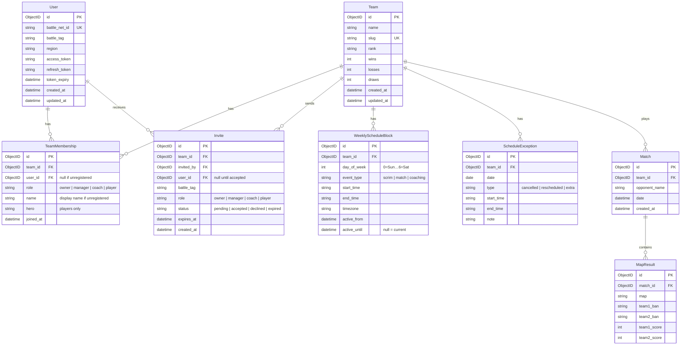

# Database Schema

## Notes

- `TeamMembership` is a junction between `User` and `Team`. `role` covers all relationships: `owner` (created the team), `manager`/`coach` (staff), `player` (roster). A user can have multiple memberships across teams.
- `user_id` on `TeamMembership` is nullable — unregistered players can be added by name, and linked to a `User` account later.
- `hero` is player-specific and left empty for non-player roles.
- `Invite.user_id` is null until the invite is accepted — matched to a `User` when they log in with the invited BattleTag. Accepting an invite creates a `TeamMembership` row.
- `MapResult` is an embedded array in MongoDB, not a separate collection — it is never queried independently of its match.
- `WeeklyScheduleBlock` is versioned via `active_from`/`active_until`. To change the schedule, close the old block and insert a new one — never mutate existing rows.
- `ScheduleException` overrides a specific date: `cancelled` removes that day's block, `rescheduled` replaces the time, `extra` adds a one-off session with no corresponding weekly slot.
- `wins`/`losses`/`draws` on `Team` are denormalized — update them when a match is saved to avoid scanning all matches on every render.
- `opponent_name` on `Match` is a plain string. Opponents are not required to be registered users in the system.
